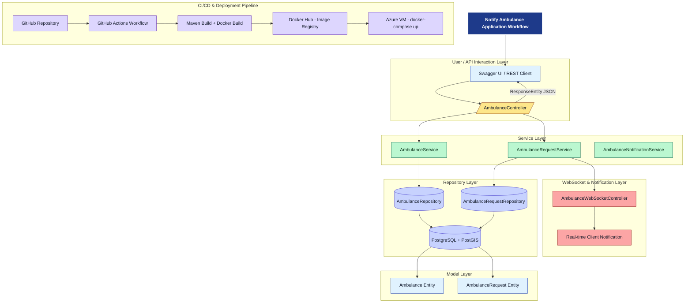

```mermaid
flowchart TD
    %% IMPROVED COLOR SCHEME (MODERN GITHUB-FRIENDLY)
    classDef title fill:#1E3A8A,stroke:#ffffff,stroke-width:2px,color:#ffffff,font-weight:bold
    classDef process fill:#E0F2FE,stroke:#1E40AF,stroke-width:1px,color:#0F172A
    classDef storage fill:#C7D2FE,stroke:#4338CA,stroke-width:1px,color:#111827
    classDef control fill:#FDE68A,stroke:#92400E,stroke-width:1px,color:#111827
    classDef logic fill:#BBF7D0,stroke:#065F46,stroke-width:1px,color:#052E16
    classDef notify fill:#FCA5A5,stroke:#991B1B,stroke-width:1px,color:#111827
    classDef deploy fill:#DDD6FE,stroke:#5B21B6,stroke-width:1px,color:#111827
    
    %% TITLE
    A[Notify Ambulance Application Workflow]:::title
    
    %% API & CONTROLLER
    subgraph API["User / API Interaction Layer"]
        U[Swagger UI / REST Client]:::process
        C1[/AmbulanceController/]:::control
    end
    
    %% SERVICE LAYER
    subgraph SERVICE["Service Layer"]
        S1[AmbulanceService]:::logic
        S2[AmbulanceRequestService]:::logic
        S3[AmbulanceNotificationService]:::logic
    end
    
    %% REPOSITORY LAYER
    subgraph REPO["Repository Layer"]
        R1[(AmbulanceRepository)]:::storage
        R2[(AmbulanceRequestRepository)]:::storage
        R3[(PostgreSQL + PostGIS)]:::storage
    end
    
    %% MODEL LAYER
    subgraph MODEL["Model Layer"]
        M1[Ambulance Entity]:::process
        M2[AmbulanceRequest Entity]:::process
    end
    
    %% WEBSOCKET
    subgraph WS["WebSocket & Notification Layer"]
        W1[AmbulanceWebSocketController]:::notify
        W2[Real-time Client Notification]:::notify
    end
    
    %% DEPLOYMENT WORKFLOW
    subgraph DEPLOY["CI/CD & Deployment Pipeline"]
        D1[GitHub Repository]:::deploy
        D2[GitHub Actions Workflow]:::deploy
        D2A[Maven Build + Docker Build]:::deploy
        D3[Docker Hub - Image Registry]:::deploy
        D4[Azure VM - docker-compose up]:::deploy
    end
    
    %% FLOW CONNECTIONS
    A --> U --> C1
    C1 --> S1 & S2
    S1 --> R1
    S2 --> R2
    R1 & R2 --> R3
    R3 --> M1 & M2
    S2 --> W1 --> W2
    C1 -->|ResponseEntity JSON| U
    
    %% DEPLOYMENT FLOW
    D1 --> D2
    D2 --> D2A
    D2A --> D3
    D3 --> D4
```
